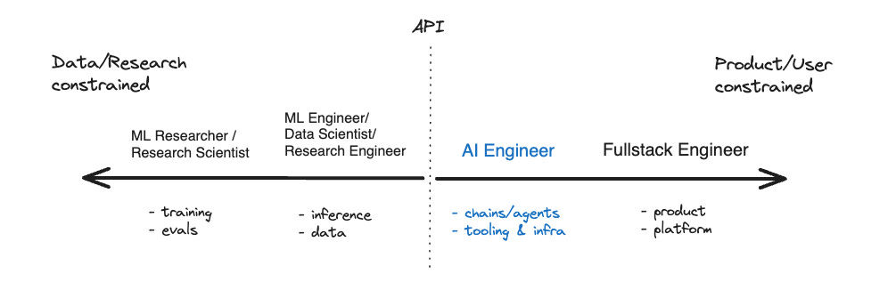
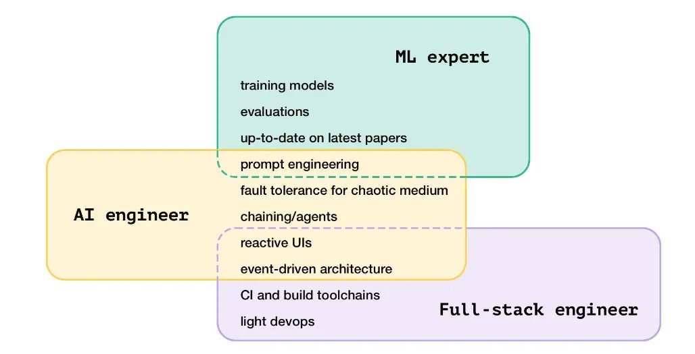
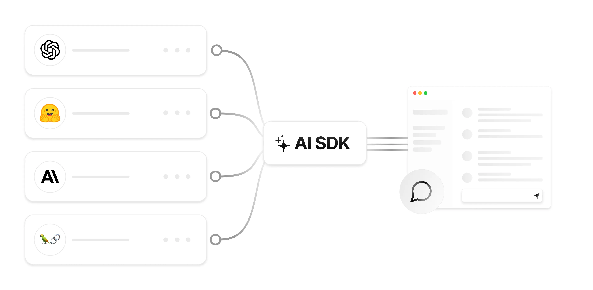

---
# try also 'default' to start simple
theme: seriph
# random image from a curated Unsplash collection by Anthony
# like them? see https://unsplash.com/collections/94734566/slidev
# background: https://cover.sli.dev
# some information about your slides, markdown enabled
title: Adding AI Capabilities to React Apps with Vercel AI SDK
# apply any unocss classes to the current slide
class: text-center
# https://sli.dev/custom/highlighters.html
highlighter: shiki
# https://sli.dev/guide/drawing
drawings:
  persist: false
# slide transition: https://sli.dev/guide/animations#slide-transitions
transition: slide-left
# enable MDC Syntax: https://sli.dev/guide/syntax#mdc-syntax
mdc: true
hideInToc: true
---
<!-- NOTE: ⌘ Command + Brightness Down to toggle screen mirroring -->
<!-- TODO: to configure shortcut to open chrome canary -->
<!-- TODO: Close all windows with right control + K -->
<!-- TODO: Make sure your arc browser profile is okay -->
<!-- TODO: Make IDE in presentation mode and move IDE terminal to the right -->
<!-- TODO: Make sure presentation theme is visible -->


# Adding AI Capabilities to React Apps with Vercel AI SDK


<div class="pt-12">
  <span  class="px-2 py-1 rounded cursor-pointer" hover="bg-white bg-opacity-10">
    Nir Tamir
  </span>
</div>

<div class="abs-br m-6 flex gap-2">
  <button @click="$slidev.nav.openInEditor()" title="Open in Editor" class="text-xl slidev-icon-btn opacity-50 !border-none !hover:text-white">
    <carbon:edit />
  </button>
  <a href="https://github.com/nirtamir2/ai-sdk-slides" target="_blank" alt="GitHub" title="Open in GitHub"
    class="text-xl slidev-icon-btn opacity-50 !border-none !hover:text-white">
    <carbon-logo-github />
  </a>
</div>


<!-- 
Welcome everyone! I'm excited to talk about adding AI capabilities to your React apps using the Vercel AI SDK. AI is revolutionizing how we build applications, and today we'll explore practical ways to incorporate it into your projects.
-->

---

<Toc minDepth="1" maxDepth="1"></Toc>

<!-- 
Let's take a look at what we'll cover today. We'll start with the basics of AI integration, move on to practical implementations, and finish with some advanced techniques.
-->

---
title: About me
layout: image-right
image: ./nirtamir.png
---

# Nir Tamir 

- Senior Frontend developer
- Work at my own company helping early stage startups
- Loves open source and tooling
- <mdi-web /> [nirtamir.com](https://nirtamir.com)
- <mdi-github /> [@nirtamir2](https://github.com/nirtamir2)
- <mdi-twitter /> [@NirTamir](https://twitter.com/NirTamir)
- <mdi-linkedin /> [@nirtamir2](https://linkedin.com/in/nirtamir2)


<!-- 
Before we dive in, let me introduce myself. I'm Nir Tamir, a senior frontend developer passionate about open source and tooling. I work with early-stage startups, helping them leverage cutting-edge technologies like AI.
-->

---
transition: fade-out
layout: quote
class: text-center text-balance
---

# You don't need to be a Data Scientist to be an AI Engineer

<!-- 
Now, I want to start with an important message: You don't need to be a data scientist to work with AI. As developers, we can leverage AI through APIs and SDKs, making it accessible for us to build intelligent applications.
-->

---
transition: fade-out
level: 2
---
# AI Engineer

<a href="https://www.latent.space/p/ai-engineer">The Rise of the AI Engineer</a>



<!-- 
Let's talk about what an AI Engineer does. As this image shows, AI Engineers work on the application side of AI, using APIs and SDKs to integrate AI capabilities into software. We're not training models, but rather using them to solve real-world problems.
-->

---
transition: fade-out
level: 2
---
# AI Engineer Skills

<a href="https://www.latent.space/p/hiring">Hiring AI Engineer</a>




<!-- 
These are some of the key skills for AI Engineers. Notice how they blend traditional software engineering with AI-specific knowledge. We'll touch on many of these skills throughout our discussion today.
-->


---
layout: cover
background: ./cruise.png
---

# My journey


<!-- 
I'd like to share a personal anecdote that illustrates the power of AI. During a recent cruise where I had no internet access, I used open-source AI models running locally on my computer to help plan my trip. This experience showed me how AI can be a powerful tool even in offline scenarios.
-->


---
layout: cover
background: ./ollama.png
title: Ollama
image: ./ollama.png
---
# Ollama

Run open source AI models locally

<!-- 
One of the tools that made this possible was Ollama. It's a fantastic platform for running open-source AI models locally. Let's dive into what makes Ollama special and how it can be useful for AI developers.
-->

---
level: 2
layout: image-right
image: ./ollama.png
layoutClass: gap-16
---
# Ollama

https://ollama.com/

<v-clicks>

- Enable running open source AI models locally
- Works offline
- [Open source](https://github.com/ollama/ollama)
- Free
- CLI
- [Vision models](https://ollama.com/blog/vision-models)
- Integrations [Copilot](https://ollama.com/blog/continue-code-assistant), [Apps](https://github.com/nirtamir2/fixkey-electron), [Zed](https://twitter.com/zeddotdev/status/1803535891584999438), Scripts...
- [Local](http://localhost:3080/) [Open WebUI](https://github.com/open-webui/open-webui)
- REST API
- [Ollama SDK](https://github.com/ollama/ollama-js)

</v-clicks>

<!-- 
Ollama offers several advantages. It's open-source, works offline, and provides a CLI interface. It supports vision models and has integrations with various development tools. Most importantly for us, it exposes a REST API that we can use in our applications.
-->


---
level: 2
---
# Calling Ollama via REST API

It has the same structure as OpenAI API hosted at http://localhost:11434

```js {monaco-run} {autorun:false}
const response = await fetch("http://localhost:11434/v1/chat/completions", {
  method: "POST",
  body: JSON.stringify({
    model: "llama3",
    messages: [
      { role: "system", content: "You are a helpful assistant."},
      { role: "user", content: "Hello!"}
    ]}),
});
const data = await response.json();
console.log(data);
```

<!-- 
Here's an example of how to call Ollama's API. Notice how similar it is to OpenAI's API structure. This compatibility makes it easier to switch between different AI providers in your applications.
-->

---
monacoRunAdditionalDeps:
- openai
---
# Ollama is compatible with OpenAI interface

```ts {monaco-run} {autorun:false}
import { OpenAI } from 'openai'

const openai = new OpenAI({
  baseURL: 'http://localhost:11434/v1',
  apiKey: 'ollama', // Does not matter which key you use
  dangerouslyAllowBrowser: true, // Just because I run it in the slide
});

const response = await openai.chat.completions.create({
  model: 'llama3',
  messages: [{ role: 'user', content: 'Tell me one line cool fact about AI' }],
});

console.log(response.choices[0].message.content)
```

<!-- 
Here we are calling OpenAI API SDK, but changing the baseURL to point to Ollama's API.
Because it's the same API - it should work the same way. Notice that some of the things are not supported by Ollama, like tools.
-->

---
level: 2
---
# Calling Ollama via SDK

https://github.com/ollama/ollama-js

````md magic-move
```js
import ollama from 'ollama'

const response = await ollama.chat({
  model: 'llama3',
  messages: [{ role: 'user', content: 'Why is the sky blue?' }],
})
console.log(response.message.content)
```

```js
import ollama from 'ollama'

const response = await ollama.chat({
  model: 'llama3',
  messages: [{ role: 'user', content: 'Why is the sky blue?' }],
  stream: true,
})
for await (const part of response) {
  console.log(part.message.content)
}
```
````

<!-- 
Ollama also provides an SDK, which simplifies the process of interacting with the AI models. Here's an example of how to use it for a simple chat interaction. We can also enable streaming for real-time responses, enhancing the user experience.
-->

---
level: 3
monacoRunAdditionalDeps:
- ollama

---
# Calling Ollama via SDK
https://github.com/ollama/ollama-js
```js {monaco-run} {autorun:false}
import ollama from 'ollama/browser'

const response = await ollama.chat({
  model: 'llama3',
  messages: [{ role: 'user', content: 'Why is the sky blue?' }],
})
console.log(response.message.content)
```

<!-- 
Let's see a practical example of using the Ollama SDK. This code snippet demonstrates how to send a simple question to the AI model and receive a response.
-->

---
level: 3
monacoRunAdditionalDeps:
- ollama
---
# Calling Ollama via SDK Streaming

https://github.com/ollama/ollama-js

```js {monaco-run} {autorun:false}
import ollama from 'ollama/browser'

const response = await ollama.chat({
  model: 'llama3',
  messages: [{ role: 'user', content: 'Why is the sky blue?' }],
  stream: true,
})
for await (const part of response) {
  console.log(part.message.content)
}
```

<!-- 
Here's how we can use streaming with the Ollama SDK. This approach allows us to receive and process the AI's response in real-time, piece by piece, which can significantly improve the perceived responsiveness of your application.
-->

---
layout: center
class: text-center
---
# AI SDK

https://sdk.vercel.ai

<!-- 
Now, let's shift our focus to the Vercel AI SDK. This toolkit provides a higher level of abstraction for working with AI models, making it even easier to integrate AI capabilities into your applications.
-->

---
level: 2
layout: iframe
url: https://sdk.vercel.ai/docs/introduction
---

[Vercel SDK](https://sdk.vercel.ai/docs/introduction)

<!-- 
Here's the documentation for the Vercel AI SDK. It's a comprehensive resource that we'll be referring to throughout our discussion. I encourage you to explore it further after this presentation.
-->

---
level: 2
---

# Getting started with Google Gemini AI

```bash
pnpm add @ai-sdk/google
```

Create `.env.local` file with your [Google API key](https://aistudio.google.com/app/apikey)

```bash
GOOGLE_GENERATIVE_AI_API_KEY="YOUR_KEY"
```

<!-- 
Let's start with a practical example using Google's Gemini AI. First, we'll install the necessary package and set up our environment variables. This setup process is crucial for securely connecting to the AI service.
-->

---
level: 2
monacoRunAdditionalDeps:
- ai
- @ai-sdk/google
- ./env
---

# AI SDK example

```ts {monaco-run} {autorun:false}
import { createGoogleGenerativeAI } from "@ai-sdk/google";
import { generateText } from "ai";
import { env } from "./env";

// Or just import { google } from "@ai-sdk/google";
const google = createGoogleGenerativeAI({
  apiKey: env.GOOGLE_GENERATIVE_AI_API_KEY,
});

const result = await generateText({
  model: google("models/gemini-1.5-flash-latest"),
  prompt: "Tell me a joke.",
});

console.log(result.text);
```


<!-- 
Here's a basic example of using the AI SDK with Google's Gemini model. We're setting up the AI, sending a prompt, and logging the response. This demonstrates how straightforward it is to interact with an AI model using the SDK.
-->


---
level: 2
layout: two-cols-header
---
# AI SDK Switch models easily

::left::
````md magic-move
```ts
import { openai } from "@ai-sdk/openai";
import { generateText } from "ai";

const result = await generateText({
  model: openai("gpt-4o"),
  prompt: "Tell me a joke.",
});
```
```ts
import { google } from "@ai-sdk/google";
import { generateText } from "ai";

const result = await generateText({
  model: google("models/gemini-1.5-flash-latest"),
  prompt: "Tell me a joke.",
});
```
```ts
import { anthropic } from "@ai-sdk/anthropic"
import { generateText } from "ai";

const result = await generateText({
  model: anthropic("claude-3-opus-20240229"),
  prompt: "Tell me a joke.",
});
```
```ts
import { mistral } from "@ai-sdk/mistral"
import { generateText } from "ai";

const result = await generateText({
  model: mistral("mistral-large-latest"),
  prompt: "Tell me a joke.",
});
```
```ts
import { ollama } from "ollama-ai-provider";
import { generateText } from "ai";

const result = await generateText({
  model: ollama("phi3"),
  prompt: "Tell me a joke.",
});
```
```ts
import { custom } from "@ai-sdk/custom"
import { generateText } from "ai";

const result = await generateText({
  model: custom("mistral-large-latest"),
  prompt: "Tell me a joke.",
});
```
````

::right::


---
level: 2
monacoRunAdditionalDeps:
- ai
- @ai-sdk/google
- ./google-model
---

# AI SDK Image example

```ts {monaco-run} {autorun:false}
import { generateText } from "ai";
import { google } from "./google-model";

const result = await generateText({
  model: google("models/gemini-1.5-flash-latest"),
  messages: [{
      role: 'user',
      content: [
        { type: 'text', text: 'Describe the image in detail.' },
        { type: 'image',  image: 'https://www.nirtamir.com/_astro/portrait.9b-_4A6X_bepz7.webp' },
      ]
    }],
});

console.log(result.text);

```

<div v-click class="absolute top-36 right-14 size-64">
 
</div>

<!-- 
The AI SDK also supports working with images. In this example, we're asking the AI to describe an image. This capability opens up many possibilities for applications involving visual content analysis.
-->

---
level: 2
layout: two-cols-header
monacoRunAdditionalDeps:
- ai
- ./google-model
- ./schema
---

<style>

[override="true"] .slidev-monaco-container-inner {
  max-height: 200px !important;
}

</style>

# AI SDK Object example
::left::
```ts {monaco-run} {autorun:false}
import { generateObject } from "ai";
import { google } from "./google-model";
import { schema } from './schema';

const { object } = await generateObject({
  model: google("models/gemini-1.5-flash-latest"),
  schema,
  prompt: 'Generate a lasagna recipe.',
});

console.log(object);

```
::right::

```ts twoslash
// schema.ts
import { z } from 'zod';

export const schema = z.object({
    recipe: z.object({
      name: z.string(),
      ingredients: z.array(
        z.object({
          name: z.string(),
          amount: z.string(),
        }),
      ),
      steps: z.array(z.string()),
    }),
  });

type Result = z.infer<typeof schema>;


```

<!-- 
The AI SDK also allows us to generate structured objects. This is particularly useful when you need specific data formats from the AI's response. Here, we're using Zod to define a schema for a recipe, which the AI will then generate.
-->


---
level: 2
monacoRunAdditionalDeps:
- ai
- zod
- ./google-model
---


<style>
  [override="280"] .slidev-monaco-container-inner {
    max-height: 280px !important;
  }

</style>

# AI SDK Tools example

```ts {monaco-run} {autorun:false, override: 280}
import { z } from 'zod';
import { google } from "./google-model";
import { generateText, tool } from 'ai';

const result = await generateText({
  model: google("models/gemini-1.5-flash-latest"),
    tools: {
    weather: tool({
      description: 'Get the weather in a location',
      parameters: z.object({
        location: z.string().describe('The location to get the weather for'),
      }),
      execute: async ({ location }) => ({
        location,
        temperature: Math.floor(Math.random() * 30) + 7,
      }),
    }),
  },
  prompt: 'What is the weather in Tel Aviv?',
});

console.log(result.toolResults);

```
  <!-- toolChoice: 'required', // force the model to call a tool 
  
    temperature: 0, // don't try to be creative here
  -->

<!-- 
The AI SDK also supports the use of tools, which allow the AI to interact with external data or functions. In this example, we're creating a weather tool that the AI can use to get weather information for a specific location.
-->
---

# Zod auto infer types

```ts twoslash
import { z } from 'zod';
import { google } from "@ai-sdk/google";
import { generateText, tool } from 'ai';

const result = await generateText({
  model: google("models/gemini-1.5-flash-latest"),
    tools: {
    weather: tool({
      description: 'Get the weather in a location',
      parameters: z.object({
        location: z.string().describe('The location to get the weather for'),
      }),
      execute: async ({ location }) => ({
        //               we can infer the type of the location
        location,
        temperature: Math.floor(Math.random() * 30) + 7,
      }),
    }),
  },
  prompt: 'What is the weather in Tel Aviv?',
});

console.log(result.toolResults);

```

---
level: 2
monacoRunAdditionalDeps:
- ai
- zod
- ./google-model
---


<style>
  [override="300"] .slidev-monaco-container-inner {
    max-height: 300px !important;
  }

</style>

# AI SDK Tools example with roundtrips 


```ts {monaco-run} {autorun:false, horizontal2: true, override: 300}
import { z } from 'zod';
import { google } from "./google-model";
import { generateText, tool } from 'ai';

const result = await generateText({
  model: google("models/gemini-1.5-flash-latest"),
    tools: {
    weather: tool({
      description: 'Get the weather in a location',
      parameters: z.object({
        location: z.string().describe('The location to get the weather for'),
      }),
      execute: async ({ location }) => ({
        location,
        temperature: Math.floor(Math.random() * 30) + 7,
      }),
    }),
  },
  maxToolRoundtrips: 5, // allow up to 5 tool roundtrips
  prompt: 'What is the weather in San Francisco and Tel Aviv?',
});

console.log(result.text);
console.log(result.responseMessages);

```


<!-- 
This example demonstrates a more complex interaction using tools and roundtrips. The AI can make multiple calls to the weather tool, allowing for more sophisticated and context-aware responses. This is particularly useful for scenarios where the AI needs to gather multiple pieces of information to formulate a complete answer.
-->

---
layout: center
level: 3
---

# Think about agents, tasks, real-time data, connect to external APIs...

https://github.com/ollama/ollama-js

<!-- 
The examples we've seen so far are just the beginning. As you delve deeper into AI integration, you can explore more advanced concepts like creating agents, defining complex tasks, incorporating real-time data, and connecting to various external APIs. The possibilities are vast and exciting.
-->

<!-- 
[agentic](https://github.com/transitive-bullshit/agentic) - A collection of 20+ tools. Most tools connect to access external APIs such as Exa or E2B.
[browserbase](https://github.com/browserbase/js-sdk?tab=readme-ov-file#vercel-ai-sdk-integration) - Browser tool that runs a headless browser
 -->

---

# AI SDK UI

<!-- 
Now, let's shift our focus to the UI aspects of AI integration. The AI SDK provides components and hooks that make it easy to create interactive AI-powered interfaces in your React applications. We'll explore how to build chat interfaces, completion components, and other AI-driven UI elements.
-->

---
layout: center
level: 2
---

`useChat` is just [SWR](https://swr.vercel.app/) wrapper

---

# AI SDK RSC

<!-- 
React Server Components (RSC) offer new possibilities for AI integration. With AI SDK RSC, we can stream AI-generated content directly from the server to the client, enabling highly dynamic and responsive AI-powered interfaces. This approach can significantly improve performance and user experience in AI-heavy applications.
-->
---
level: 2
---
- StreamUI the call
- useActions


---

# The futue

---
level: 2
layout: two-cols-header
---

# Chrome 127 Experimental Built In AI Provider

::left::
<Tweet id="1799334729365487869" scale="0.65" />

::right::
<Tweet id="1804141104696016932" scale="0.65" />


<!-- 
An exciting development in the AI space is Chrome's experimental built-in AI provider. This feature, available in Chrome 127, allows developers to access AI capabilities directly through the browser. Let's look at some early reactions and potential implications of this technology.
-->

---
level: 2
layout: iframe-right
url: https://chrome-ai-play.vercel.app/
monacoRunAdditionalDeps:
- ai
- chrome-ai
---

# Chrome 127 Experimental Built In AI Provider

https://developer.chrome.com/docs/ai/built-in

[chrome-ai](https://github.com/jeasonstudio/chrome-ai)

```ts {monaco-run} {autorun:false}
import { chromeai } from "chrome-ai";
import { generateText } from "ai";

const result = await generateText({
  model: chromeai(),
  prompt: "Tell me a joke.",
});

console.log(result.text);
```


<!-- 
Let's look at a practical example of using Chrome's built-in AI provider. This code demonstrates how to generate text using the Chrome AI, showcasing the simplicity and power of browser-based AI capabilities.
-->

---
level: 2
---

# WebGPU enables to run more AI models in the browser

<Tweet id="1788177160227660079" scale="0.65" />


<!-- 
WebGPU is a game-changer for running AI models in the browser. It provides the necessary performance boost to execute complex AI tasks client-side, opening up new possibilities for responsive and privacy-preserving AI applications.
-->


---
hide: true
---

# References (Ollama-js)

<Tweet id="1750000760450851030" scale="0.65" />

---

# References

<Tweet id="1727731541781152035" scale="0.65" />

<!-- 
Throughout this presentation, we've covered a lot of ground. Here's a tweet that teach you a little bit more about the magic of AI. It's not related to the coding, but I'm highly recommend to watch it in order to unserstand the power of AI.
-->

---
layout: end
---

# Thank you!

- <mdi-web /> [nirtamir.com](https://nirtamir.com)
- <mdi-github /> [@nirtamir2](https://github.com/nirtamir2)
- <mdi-twitter /> [@NirTamir](https://twitter.com/NirTamir)
- <mdi-linkedin /> [@nirtamir2](https://linkedin.com/in/nirtamir2)
- <mdi-presentation /> [Slides](https://github.com/nirtamir2)
- <mdi-blog /> [Blog post](https://nirtamir.com)


<!-- 
Thank you all for your attention! I hope this presentation has given you insights into how to add AI capabilities to your React apps using the Vercel AI SDK. Remember, the field of AI is rapidly evolving, and there's always more to learn. Feel free to reach out if you have any questions or want to discuss AI integration further.
-->

---

# Further Reading
- Security
- Rate limits
- Prompt engineering
- Langchain
- RAG
- Agents

---
transition: slide-up
hideInToc: true
---

# Glossary

|       |                                              |
| ----- | -------------------------------------------- |
| AI    | Artificial intelligence                      |
| LLM   | Large language model (ChatGPT)               |
| RAG   | Retrieval-Augmented generation (Adding data) |
| genUI | UI generated by AI                           |

<!-- AI - Rather than explicitly programming a computer to perform a task, AI systems are trained on a large amount of data, allowing them to learn patterns and make predictions or decisions based on that
 -->

<!-- LLM A large language model (LLM) is a type of artificial intelligence (AI) program that can recognize and generate text, among other tasks (ChatGPT)
 -->

 <!-- A generative UI (genUI) is a user interface that is dynamically generated in real time by artificial intelligence to provide an experience customized to fit the user's needs and context
  -->

<!--
Retrieval-Augmented Generation (RAG) is the process of optimizing the output of a large language model, so it references an authoritative knowledge base outside of its training data sources before generating a response.
-->


---
hide: true
---

TODO:
- RSC - try to understand it better and demonstrate it
- Cool stuff with agents 